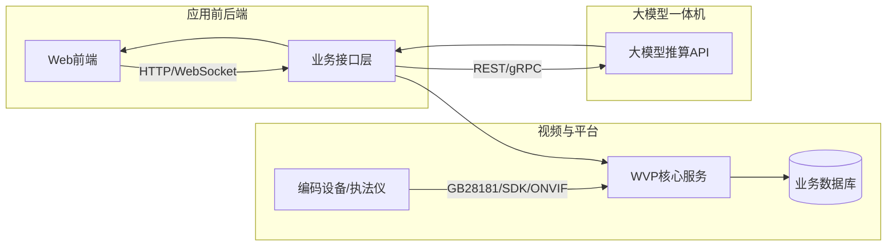

## 功能设计计划：视频联网上平台与大模型一体化

### 一、目标与范围

- **目标**：在现有 `wvp-GB28181-pro` 能力基础上，补齐招标文中评分条款相关功能，形成可演示、可验收的统一视频平台与大模型一体机一体化方案。
- **范围**：
  - 在后端（`src/main/java`）梳理和扩展接口以支持多画面预览、录像多维检索、案(事)件闭环流转、告警处置流程、运维报表等。
  - 在前端（`web/` 与 `demo/`）新增/优化页面，覆盖评分条款 1~8 的演示点。
  - 集成外部大模型推算一体机 API，开发“自然语言交互 + 算法编排/训练/零样本”前端模块。

### 二、总体架构设计

- **后端**：在现有信令、设备、录像、告警、日志等模块基础上，补充多维检索、案事件流转、告警处置、运维报表等业务接口，并新增对大模型 API 的封装服务层。
- **前端**：在现有预览/回放/设备管理页面基础上，增强多画面和检索能力，新增案(事)件管理、告警处置、运维大盘和“大模型推算中心”模块。

### 三、核心功能设计（对应评分条款）

#### 1. 视频资源统一接入与管理
- **现有能力利用**：
  - 使用现有 GB28181、Ehome、ISUP、ONVIF 等接入模块（`src/main/java/.../sip`, `device` 等包）和目录管理能力，构建市局/区局二级节点树。
- **功能设计要点**：
  - **多层级目录**：在后端增加“区域/机构维度”字段与层级配置，支撑“市-区-下级单位-监控点”树形结构展示。
  - **设备树组件**：在前端扩展设备树，支持按区域、单位、类型等多维筛选；高亮在线/离线状态。
  - **多协议接入**：确保支持海康/大华 SDK、Ehome、ISUP、GB28181、ONVIF 协议接入，并实现统一管理。

#### 2. 实时视频调阅能力
- **多画面预览**：
  - 前端新增 1/4/9/16 宫格预览布局，支持栅格/拖拽操作。
  - 对接现有拉流接口，支持多路视频并发播放。
- **码流与清晰度**：
  - 支持主/子码流切换，前端提供清晰度选择（高清/标清）。
- **上墙与水印**：
  - 增加“上墙”功能入口，联动大屏矩阵。
  - 视频画面叠加水印（时间戳、终端标识、防篡改信息）。

#### 3. 录像回放与多维检索
- **时间轴与倍速**：
  - 前端构建可视化时间轴，支持 0.5/1/2/4 倍速回放。
- **多维检索**：
  - 扩展检索条件：支持按时间段、设备、场所、标签、关键词（AI 分析标签）组合查询。
- **片段导出与防篡改**：
  - 提供录像裁剪导出功能，导出文件需带防篡改数字水印或签名信息。

#### 4. 案(事)件库闭环管理
- **数据模型**：
  - 新增 `case_event` 表，包含类型、地点、时间、涉事对象、级别、标签等字段。
  - 关联多媒体证据（视频、图片、快照、文本）。
- **流程管理**：
  - 实现“受理 → 研判 → 处置 → 归档”的状态流转机制。
- **前端实现**：
  - 开发案事件管理模块，支持列表展示、详情查看、证据关联及状态更新。

#### 5. AI 智能识别场景展示
- **算法任务配置**：
  - 配置烟火、徘徊、聚集、违规停车、打电话、未戴安全帽等检测任务。
- **告警展示与统计**：
  - 实时展示 AI 告警信息（类型、时间、快照、置信度）。
  - 提供告警命中率及趋势图表统计。
- **联动回放**：
  - 点击告警记录可直接回放关联的视频片段。

#### 6. 自然语言交互与大模型应用
- **自然语言交互**：
  - 实现聊天式交互界面，用户输入（如“检测佩戴黄帽子的人员”），系统自动解析意图并调用相应算法或查询接口。
- **算法编排**：
  - 支持通过自然语言描述逻辑（如“先检测A，再检测B”），自动生成算法编排流程。
- **零样本/少样本训练**：
  - 提供界面支持上传少量样本（如几十张图片），通过简单的“对/错”标注，分钟级生成或优化算法模型（冷启动）。
- **模型管理**：
  - 展示模型列表（名称、版本、训练状态），支持模型上传、下载及分发。

#### 7. 实时告警机制与处置流程
- **告警流看板**：
  - 实时展示告警流，支持按类型、级别、来源、区域筛选。
- **处置流程**：
  - 提供“确认”、“指派”、“备注”、“关闭”等处置操作。
  - 支持批量处置功能。
- **多渠道推送**：
  - 模拟或集成短信/APP 推送接口，记录推送历史。

#### 8. 运维与质量诊断报表
- **设备巡检**：
  - 自动巡检视频设备，检测在线率、信号状态、画面卡顿/延迟等。
- **质量诊断**：
  - 识别视频质量问题（模糊、遮挡、过亮/暗、抖动、丢帧），生成诊断报告。
- **系统监控**：
  - 实时监控服务状态、数据库、网络、存储资源（本地/云端），提供健康评分与异常告警。
- **报表展示**：
  - 使用图表展示运维数据、设备在线率趋势、故障统计等。

#### 9. 大数据分析展示
- **可视化大屏**：
  - 设计大数据展示页面，利用热力图、动态图、仪表盘展示关键指标（执法效率、预警数据、设备状态）。

#### 10. 执法记录仪与数据对接
- **执法仪接入**：
  - 确保支持执法记录仪（如通过 GB28181 或 SDK）接入，实现集中存储管理。
- **执法过程追溯**：
  - 记录执法活动日志，支持时间轴追溯与事件标记。
- **数据对接**：
  - 提供接口供外部系统调用视频及分析结果。

### 四、实施步骤

1. **后端基础扩展**：完善数据库表结构（案事件、告警、日志），扩展 API 接口。
2. **AI 接口集成**：封装大模型一体机 API，实现自然语言解析与任务下发。
3. **前端页面开发**：
   - 优先开发“视频预览”、“录像回放”、“设备管理”等核心高频页面。
   - 开发“案事件库”、“告警中心”、“运维大盘”等业务页面。
   - 开发“大模型推算中心”特色功能页面。
4. **联调与验证**：前后端联调，模拟设备与 AI 数据进行全流程验证。
5. **演示环境准备**：准备演示数据（模拟视频流、模拟告警、模拟案事件），确保演示流畅。
