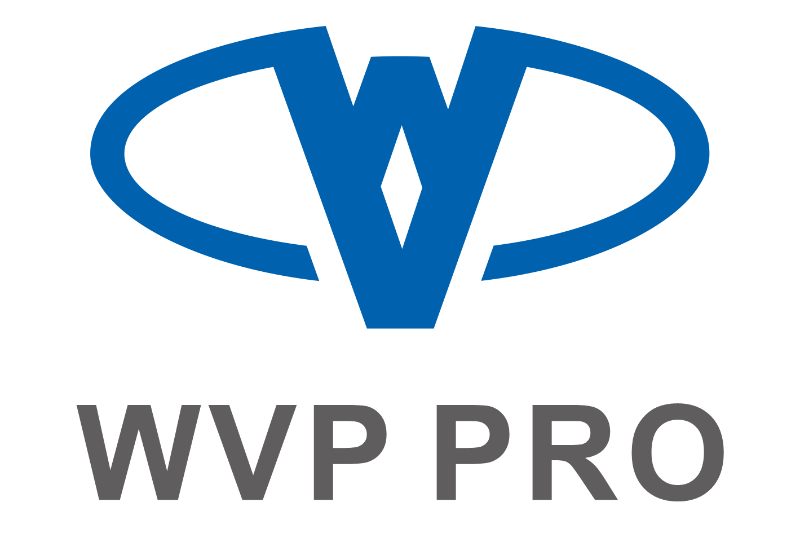
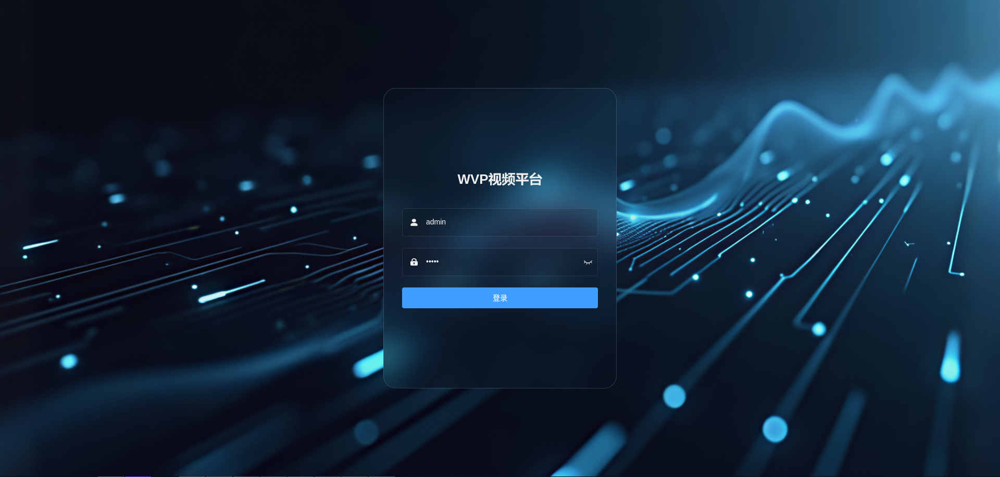
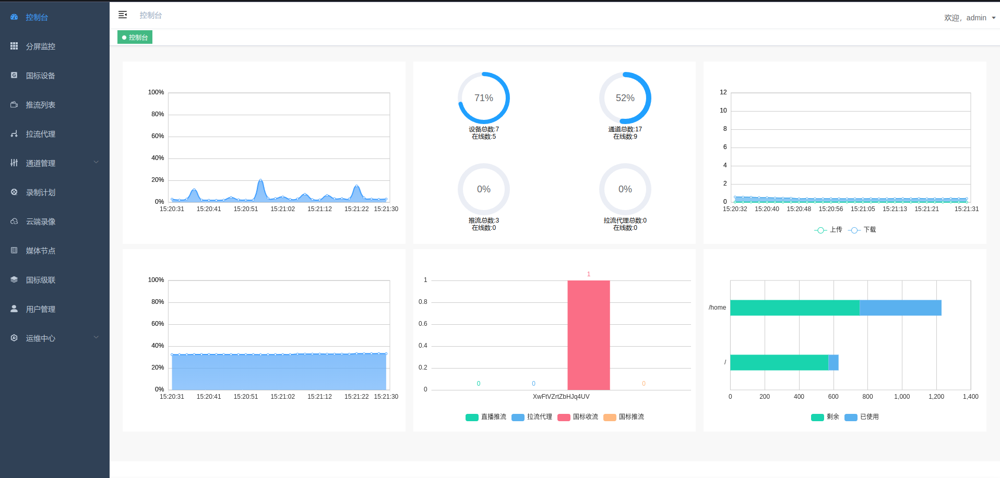
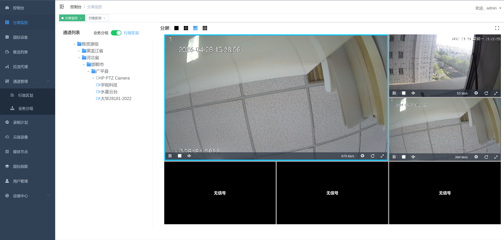
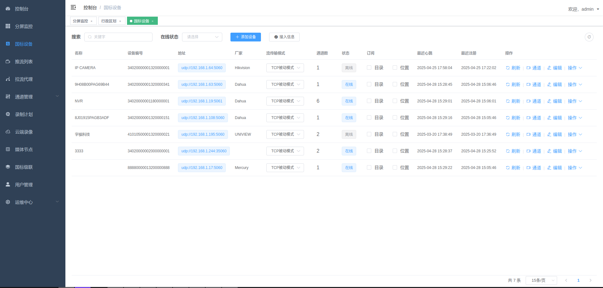
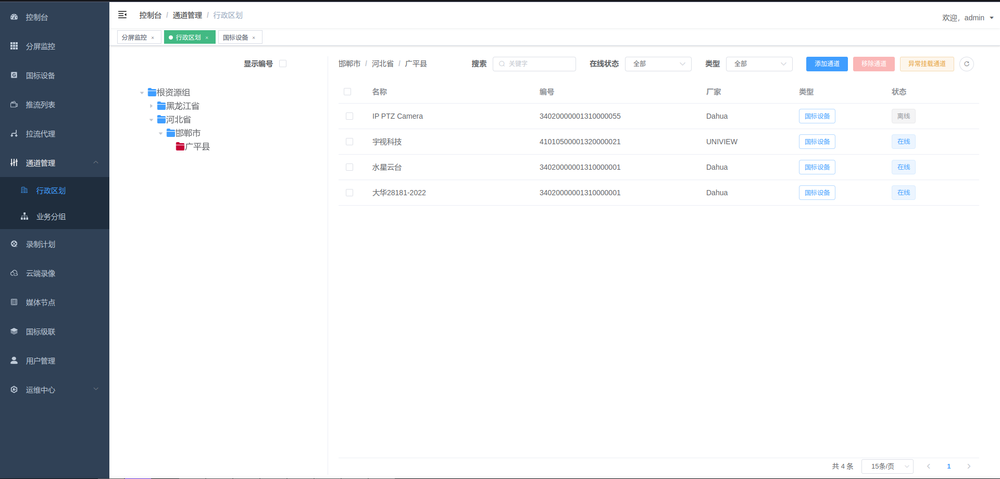
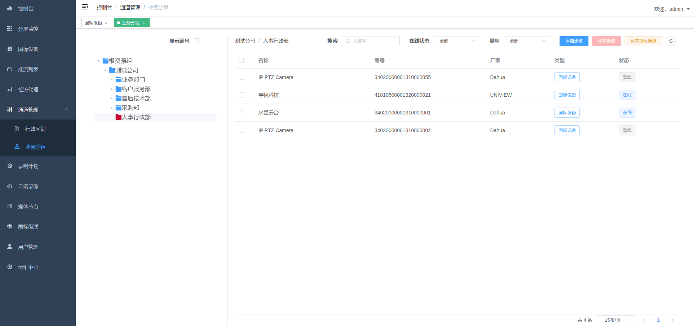

# 专卖行政执法音像记录管理系统


**专卖行政执法音像记录管理系统** 是一个基于 **GB28181-2016/2022** 标准和 **JT/T 1078** 标准实现的开箱即用的网络视频管理平台。项目负责实现核心信令交互、设备管理、行业业务扩展及流媒体控制，流媒体服务底层依赖高性能的 [ZLMediaKit](https://github.com/ZLMediaKit/ZLMediaKit)。

不仅支持标准的安防监控接入，更深度集成了**执法记录仪管理**、**案事件库**、**AI 报警联动**及**云端录像**等行业应用功能，适用于智慧安防、行政执法、车载监控等多种场景。

---

## 📚 核心功能特性

### 📹 基础视频能力
- **多协议接入**: 支持 **GB28181** (IPC/NVR/平台)、**JT/T 1078** (车载终端)、**RTSP/RTMP** 推拉流接入。
- **实时预览**: 支持 WebRTC、HTTP-FLV、WebSocket-FLV、HLS 等多种低延迟播放协议；支持 H.264/H.265 编码。
- **云台控制**: 支持 PTZ 控制（转向/变焦）、预置位设置与调用、看守位功能。
- **录像回放**:
    - **设备录像**: 查询并回放 NVR/IPC 本地 SD 卡或硬盘录像。
    - **云端录像**: 基于 **MinIO** 对象存储，支持 24h 录像或报警录像的云端持久化存储与回放。
- **语音对讲**: 支持国标语音对讲功能。

### 👮 行业应用与扩展
- **执法音像记录管理**: 
    - 专为行政执法场景设计，支持执法记录仪接入。
    - 完整的执法日志记录、操作审计与证据链闭环管理。
- **案事件库管理**: 
    - 支持案件/事件信息的录入与管理。
    - 多媒体证据（视频/图片）关联与状态流转。
- **AI 智能联动**: 
    - 提供 AI 模型管理接口。
    - 支持报警接收与联动（如移动侦测、行为分析），通过 Redis 消息队列实现实时推送。
- **大数据可视化**: 集成 GIS 电子地图与服务器资源监控仪表盘。

### 🌐 高级网络特性
- **国标级联**: 支持作为下级平台向上级级联，或作为上级平台接入下级；支持多级级联与跨网互联。
- **网络穿透**: 支持 UDP/TCP 传输模式，具备良好的 NAT 穿透能力；支持公网部署。
- **安全鉴权**: 完善的接口鉴权机制（Spring Security + JWT）与推流鉴权。

---

## 🏗 系统架构与技术栈

本项目采用前后端分离架构，支持 Docker 容器化一键部署。

### 后端 (Backend)
- **开发语言**: Java 21
- **核心框架**: Spring Boot 3.4.4
- **ORM 框架**: MyBatis + PageHelper
- **数据库**: MySQL / PostgreSQL / Kingbase8 (人大金仓) / H2
- **缓存/消息**: Redis
- **SIP 协议栈**: Jain SIP
- **对象存储**: MinIO (用于云端录像与证据存储)
- **流媒体服务**: ZLMediaKit (核心媒体引擎)

### 前端 (Frontend)
- **管理平台**: Vue 2.6 + Element UI (基于 vue-admin-template)
- **演示 Demo**: Vue 3.4 + Vite + Element Plus
- **播放器**: 集成 Jessibuca, h265web.js

---

## 🚀 快速开始

### 方式一：Docker 一键部署（推荐）

使用 Docker Compose 可以快速启动包括 WVP、ZLMediaKit、Redis、MySQL 在内的所有服务。

```bash
cd docker
# 启动所有服务
docker-compose up -d
```
详细说明请参考：[Docker部署文档](docker/WVP_DOCKER_BUILD.md)

### 方式二：本地开发部署

#### 1. 启动依赖服务
确保本地已安装并启动以下服务：
- Redis
- MySQL (导入 `sql` 目录下的初始化脚本)
- ZLMediaKit (需开启 hook 钩子)
- MinIO (可选，用于云端录像)

#### 2. 启动后端 (WVP-PRO)
```bash
# 编译项目
mvn clean package

# 启动服务
java -jar -Dspring.profiles.active=dev target/wvp-pro-*.jar
```

#### 3. 启动前端 (Web UI)
```bash
cd web
# 安装依赖
npm install
# 启动开发服务器
npm run dev
```

访问地址：`http://localhost:9528` (默认)

---

## 🖼 系统截图

<table>
    <tr>
        <td ><center>登录页面 </center></td>
        <td ><center>系统首页</center></td>
    </tr>
    <tr>
        <td ><center>分屏播放 </center></td>
        <td ><center>国标设备列表</center></td>
    </tr>
    <tr>
        <td ><center>行政区划管理 </center></td>
        <td ><center>业务分组管理</center></td>
    </tr>
</table>

---

## 📄 文档与支持

- **API 文档**: 启动服务后访问 `/doc.html` (Knife4j) 或 `/v3/api-docs`

---

## 🤝 致谢

感谢以下开源项目及作者的杰出贡献：
- 流媒体服务框架: [ZLMediaKit](https://github.com/ZLMediaKit/ZLMediaKit) by @夏楚
- H5 播放器: [Jessibuca](https://github.com/langhuihui/jessibuca) by @langhuihui
- H.265 播放器: [h265web.js](https://github.com/numberwolf/h265web.js) by @Numberwolf-Yanlong

## ⚖️ 授权协议

本项目遵循 **MIT 许可证**。您可以免费用于商业或非商业项目，但必须保留版权声明。
部分依赖库可能遵循其他开源协议，请在使用时查阅相关文档。
